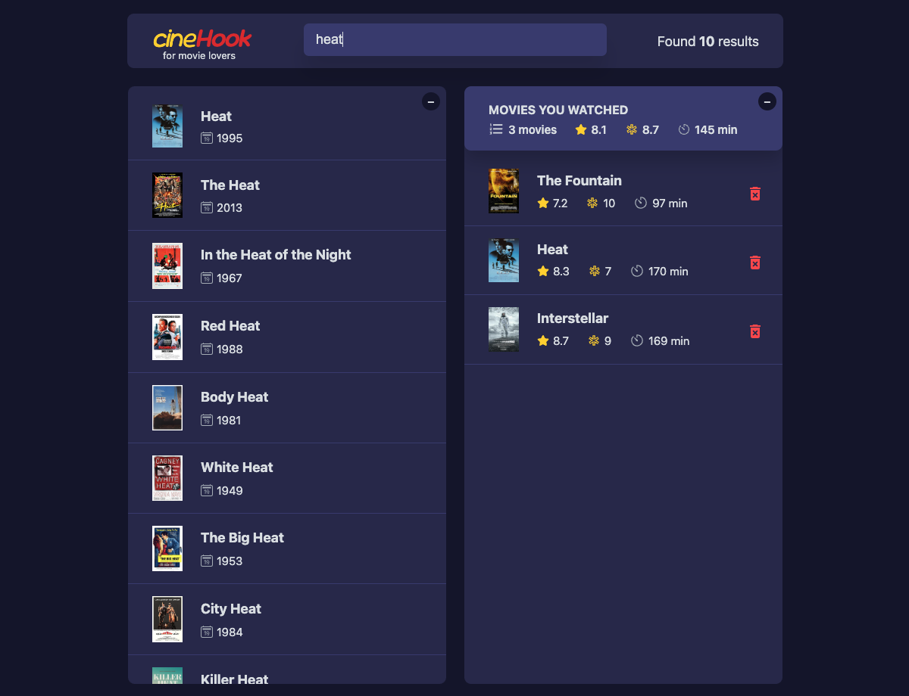
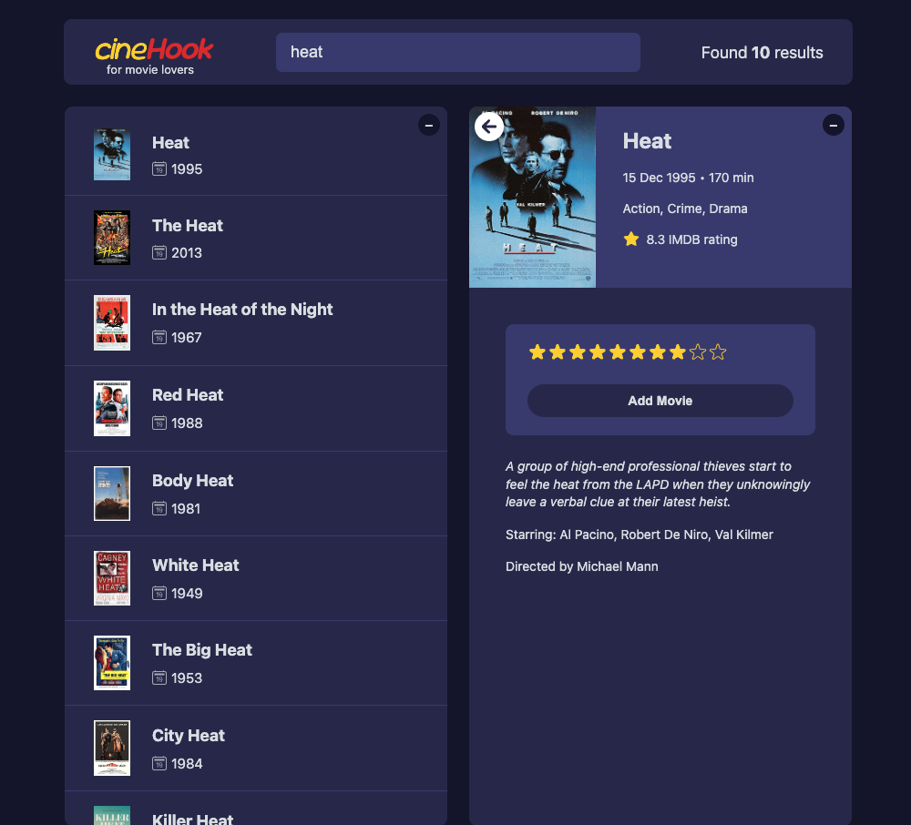

# 🎬 CineHook

CineHook is a modern movie search and watchlist application built with **React** and **TypeScript**. It allows users to search for movies, view details, and maintain a watchlist with ratings. The app fetches movie data from the **OMDb API** and provides a smooth, interactive experience with persistent local storage.

## 🖼️ Screenshots

### 📌 Home Screen

### 📌 Rating a Movie

## 🚀 Features

- 🔍 **Search for Movies** – Fetch movie details from the OMDb API.
- 📄 **View Movie Details** – See IMDb ratings, runtime, and descriptions.
- ✅ **Manage a Watchlist** – Add, rate, and remove watched movies.
- 💾 **Persistent Data** – Saves watchlist using local storage.
- 🎭 **Dynamic UI** – Switch between "searched movies" and "watched movies."

## 🛠️ Tools & Technologies

- ⚛️ **React** – Component-based UI development
- 🟦 **TypeScript** – Static typing for better reliability
- 🎨 **SCSS** – Improved styling and maintainability
- 🗄 **Local Storage** – Persistent watchlist data
- 🎬 **OMDb API** – Fetches real-time movie details

## 🔗 Demo

- 🌍 [Live Demo](#) – _Coming soon! Stay tuned._

## 🧪 Testing

- Tests are not implemented yet, but they will be added soon using **Vitest** and **React Testing Library** to ensure reliability and maintainability.

## 📂 Setup & Installation

1️⃣ Clone the repository:
git clone https://github.com/emad-abaei/cineHook.git

2️⃣ Navigate to the project directory:
cd cineHook

3️⃣ Install dependencies:
npm install

4️⃣ Run the development server:
npm run dev

## 📩 Contributing

Contributions are welcome! Feel free to submit issues or pull requests.

## 📜 License

This project is licensed under the MIT License.
